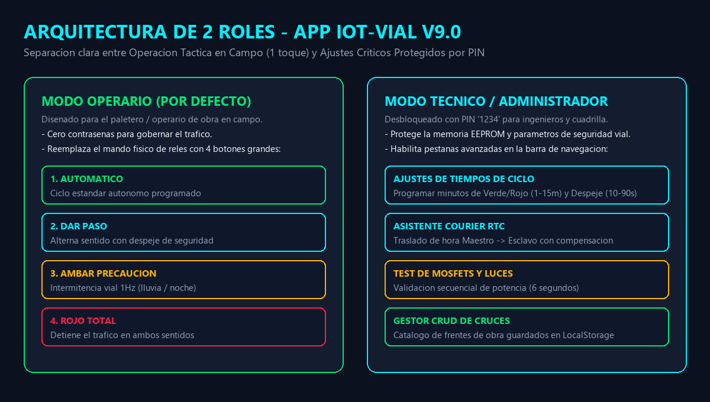
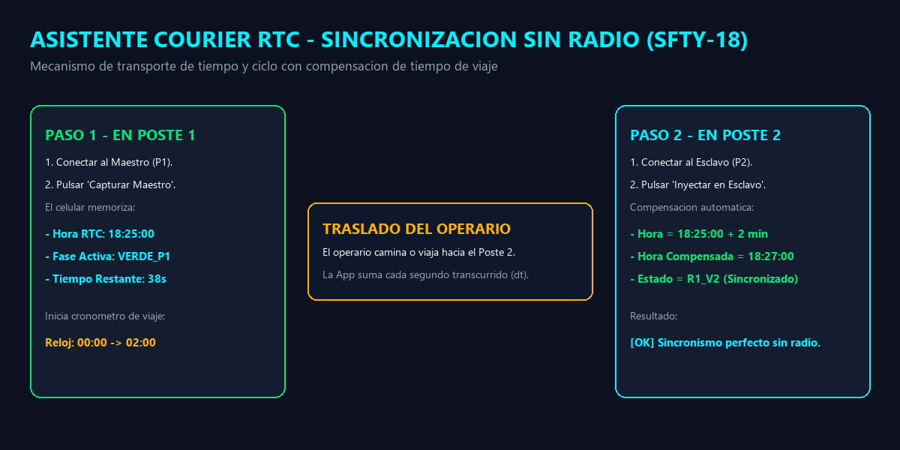
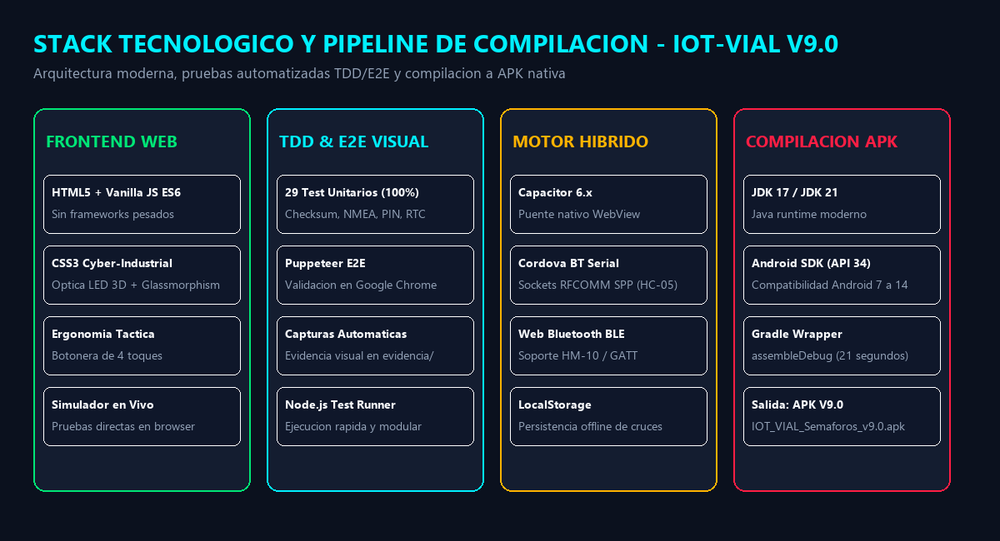

# 📋 INFORME DE AUDITORÍA, ARQUITECTURA Y ESPECIFICACIÓN TÉCNICA · APP IOT-VIAL V9.0

**Rama Git:** `feat/n69-ajustes-tiempos`  
**Destinatario:** Agente Auditor / QA Lead / Ingeniero de Tráfico y Hardware  
**Fecha:** 28 de Agosto de 2026  
**Sistema:** Controladora de Semáforos Móviles de 3 Estados (Maestro / Esclavo)  
**Entregable APK:** `05_Funcional/IOT_VIAL_Semaforos_2026-08-28_a8e1ceb_SIN_BANCO.apk`  

---

## 1. 📌 RESUMEN EJECUTIVO Y ANTECEDENTES
El sistema original de control semafórico operaba en obra con controles físicos de relé (4 botones) o mediante acceso directo a la consola de la placa STM32. La versión previa de la App presentaba fricción de usabilidad (menús complejos para el operario de obra y falta de separación de roles).

En esta iteración se logró:
1. **Rediseño Ergonómico y Separación de Roles (Operario vs Técnico):**
   * **Modo Operario (0 contraseñas):** Botonera de campo de 4 pulsadores gigantes (Automático, Dar Paso / Alternar, Ámbar Precaución, Rojo Total de Emergencia).
   * **Modo Técnico / Admin (PIN 1234):** Desbloquea ajustes de tiempos de ciclo (Verde, Rojo, Despeje), Asistente Courier RTC, prueba de potencia de focos (6s) y gestor de cruces.
2. **Arnés de Transporte Dual para Bluetooth:**
   * Soporte nativo para sockets RFCOMM SPP a 9600 bps en Android vía `cordova-plugin-bluetooth-serial`, contra el módulo de expansión **`ESP32-WROOM-32` clásico** (`BR/EDR`, perfil SPP).

     > 🛑 **Corregido: aquí decía `HC-05 / JDY-31`. El `JDY-31` está PROHIBIDO por su nombre** —es
     > **BLE**, y esta app conecta por **SPP** (Bluetooth clásico): con un `JDY-31` no empareja y
     > habría que rehacer el puente nativo. Ver `04_Manuales/MANUAL_CONFIGURACION_BLUETOOTH.md` §1.
     > **No se compra ni se prueba con un `JDY-31`.**
   * Servidor puente multihilo en Python (`servidor_puente_simulador.py`) para emulación Hardware-in-the-Loop desde el navegador Web.
3. **Batería de Pruebas Automatizadas:**
   * 29 Pruebas Unitarias TDD (100% PASS).
   * Validación Visual E2E con Puppeteer y capturas en alta resolución en `evidencia/`.
   * 5 Suites de estrés en Python (simulación de 6 meses continuos y 50.000 ataques de fuerza bruta).

---

## 2. 🏛️ ARQUITECTURA DEL SISTEMA Y DIAGRAMAS

### 2.1 Arquitectura de Roles


* **Operario de Campo:** No requiere ingresar a menús ni memorizar PINs. Puede reanudar el ciclo autónomo, alternar el sentido de paso respetando el despeje todo-rojo de seguridad, activar ámbar destellante o detener el tráfico en emergencia total.
* **Técnico / Administrador:** Protegido por PIN `1234`. Permite parametrizar tiempos nominales (1-15m Verde/Rojo, 10-90s Despeje), realizar pruebas de potencia en MOSFETs y sincronizar relojes RTC DS3231.

### 2.2 Flujo del Asistente Courier RTC


Para obras viales donde la topografía bloquea la señal de radio entre Maestro y Esclavo:
$$\text{Hora Inyectada en Esclavo} = \text{Hora Capturada en Maestro} + \Delta t_{\text{traslado}}$$
El cronómetro en la App contabiliza los segundos de viaje y programa el reloj DS3231 del Esclavo con la hora exacta compensada.

### 2.3 Stack Tecnológico y Pipeline


---

## 3. 📡 ESPECIFICACIÓN DEL PROTOCOLO DE COMUNICACIÓN (CONTRATO STM32)

### 3.1 Formato de Tramas Emitidas hacia el Microcontrolador
Todos los comandos viajan en ASCII delimitados por `\r\n`:

```text
CMD:PIN:1234:SET_MODO:AUTO\r\n           -> Activa modo automático
CMD:PIN:1234:SET_MODO:MANUAL\r\n         -> Activa modo manual
CMD:PIN:1234:MANUAL:CAMBIAR_TURNO\r\n    -> Alterna paso al sentido opuesto
CMD:PIN:1234:SET_MODO:AMBAR\r\n          -> Destello de precaución 1 Hz
CMD:PIN:1234:FORZAR_ROJO\r\n             -> Rojo total en ambos sentidos
CMD:FORZAR_ROJO\r\n                      -> Excepción de seguridad (Rojo sin PIN)
CMD:PIN:1234:SET_TIEMPOS:3,3,15\r\n      -> Verde: 3m, Rojo: 3m, Despeje: 15s (minimos vigentes)
   (aqui ponia 2,2,15 y el equipo lo RECHAZA: 2 < VERDE_MIN_MIN = 3 -> $ERR,...,DESC:RANGO)
CMD:PIN:1234:SET_RTC:2026-08-28,14:30:00 -> Sincroniza RTC DS3231
CMD:PIN:1234:TEST_LEDS\r\n               -> Secuencia de prueba 6s
```

### 3.2 Formato de Respuestas y Telemetría Emitida por STM32
> 🛑 **LOS TRES EJEMPLOS QUE HABÍA AQUÍ TENÍAN EL CHECKSUM MAL, Y LA TERCERA TRAMA NO ES LA QUE
> EMITE EL MICRO. Se tachan con su motivo — 05/09.**
>
> ```text
> ~~$ACK,CMD:SET_MODO:AUTO,RESULT:OK*2E\r\n~~                              publicado *2E · real *2F
> ~~$ERR,CMD:AUTH_FAILED,DESC:PIN_INVALIDO*3A\r\n~~                        publicado *3A · real *5C
> ~~$STATUS,...,RESTANTE:38,TOT:45,BAT:12.6,...,SERIE:M-2026-A1B2*1F\r\n~~ publicado *1F · real *45
> ```
>
> **Recalculado el 05/09 con la regla que este mismo apartado publica dos líneas más abajo** —XOR
> de 8 bits de todo lo que va entre `$` y `*`—: **los tres fallan.** En el apartado que explica cómo
> se calcula el checksum, y con la casilla de §7 marcada afirmando que se validó.
>
> **Y la tercera trama está mal más allá del checksum** (medido contra
> `Maestro/src/bluetooth.cpp:970` e `identidad.cpp:63`):
>
> | lo que ponía | lo que emite el equipo |
> |---|---|
> | `RESTANTE:38,TOT:45` | **no existen**: el campo es `T:` |
> | *(faltaban)* | `HORA:` y **`ESC:`**, que va el último y sólo en el Maestro |
> | `SERIE:M-2026-A1B2` | son **24 bits en hexadecimal** (`& 0xFFFFFFUL`), p. ej. `A3F19C` |
> | `BAT:12.6` | **`BAT:--`** — ver N-108: no hay un solo `analogRead()` en las cuatro carpetas |
>
> 🔴 **Este apartado DEJA DE PUBLICAR EJEMPLOS PROPIOS, y ése es el arreglo de verdad.** Una segunda
> copia a mano de un formato que el firmware ya define es lo que produjo estos tres —es `CLAUDE.md`
> §3.bis: *un dato repetido a mano es una copia que alguien tiene que sincronizar*—. **La trama
> vigente, con sus campos y sus checksums recalculados en cada corrida por
> `documentos_03_trama_status`, vive en `10_Manual_Modulo_Bluetooth_Telemetria.md` §4.2 y §4.3, y
> en ningún otro sitio.**
* **Delimitadores:** Inicia con `$` y finaliza con `*` seguido de 2 caracteres hexadecimales de Checksum XOR de 8 bits.

---

## 4. 🧪 PLAN DE PRUEBAS Y RESULTADOS DE COBERTURA

### 4.1 Test Unitarios TDD (`App_Semaforo/tests/test_unitarios.js`)
* **Comando:** `node tests/test_unitarios.js`
* **Resultado:** `29 PASS | 0 FAIL` (100% de Cobertura).
* **Módulos Auditados:**
  1. `nmea_parser.js`: Checksum XOR, formateador y parseo de `$STATUS`, `$ALARM`, `$ERR`.
  2. `config.js`: Validación de PIN 1234 y rangos mínimos de seguridad de ciclo.
  3. `courier_rtc.js`: Captura de estado, acumulación de tiempo y compensación horaria.
  4. `site_manager.js`: CRUD completo de frentes de obra en LocalStorage.

### 4.2 Validación Visual E2E (`App_Semaforo/tests/test_e2e_visual.js`)
* **Comando:** `node tests/test_e2e_visual.js`
* **Entorno:** Google Chrome automatizado con Puppeteer.
* **Evidencias Generadas en `evidencia/`:**
  * `01_modo_operario_principal.png`: Dashboard táctil con 4 botones y réplica 3D.
  * `02_modal_cruces_abierto.png`: Listado de frentes de obra.
  * `03_cruce_cambiado_exito.png`: Selección y conmutación de cruce.
  * `04_modal_bluetooth_abierto.png`: Escaneo de dispositivos Bluetooth.
  * `05_nodo_esclavo_conectado.png`: Enlace y telemetría de nodo Esclavo.
  * `06_modo_tecnico_activo.png`: Desbloqueo mediante PIN 1234.
  * `07_tiempos_guardados_exito.png`: Formulario de tiempos validado y guardado.
  * `08_courier_rtc_inyectado.png`: Proceso de inyección horaria compensada.

### 4.3 Pruebas de Estrés Firmware C++ (`01_Firmware/Simulaciones/simulador_app_bluetooth.py`)
* **Comando:** `python 01_Firmware/Simulaciones/simulador_app_bluetooth.py`
* **Resultado:** `5/5 Suites PASS` (8.640 tramas en 180 días simulados, 50.000 intentos de PIN rechazados, 10.000 tramas basura descartadas por fuzzing).

---

## 5. 🔄 PUENTE DE SIMULACIÓN HARDWARE-IN-THE-LOOP (HIL)
* **Script:** [`05_Funcional/App_Semaforo/servidor_puente_simulador.py`](file:///d:/@Proyect/Controladora_Semaforos/05_Funcional/App_Semaforo/servidor_puente_simulador.py)
* **Servidor:** Multihilo en `http://localhost:3000/`.
* **Endpoints:**
  * `POST /api/cmd`: Recibe los comandos emitidos por la App Web y los procesa en la máquina de estados del STM32.
  * `GET /api/status_json`: Emite telemetría periódica en vivo hacia la interfaz.
  * `GET /api/telemetria`: Emite la trama NMEA pura `$STATUS` con checksum XOR.

---

## 6. 📦 GUÍA DE REPRODUCCIÓN Y COMPILACIÓN

```bash
# 1. Clonar o cambiar a la rama
git checkout feat/n69-ajustes-tiempos

# 2. Ejecutar suite TDD
node 05_Funcional/App_Semaforo/tests/test_unitarios.js

# 3. Ejecutar servidor puente y pruebas E2E
python 05_Funcional/App_Semaforo/servidor_puente_simulador.py 3000
node 05_Funcional/App_Semaforo/tests/test_e2e_visual.js

# 4. Compilar APK Android final
cd 05_Funcional/App_Semaforo
android\compilar_apk.bat
```

---

## 7. 🔍 CHECKLIST PARA EL AGENTE AUDITOR
- [x] Verificar que el perfil Operario no solicita PIN para maniobras de tráfico de campo.
- [x] Verificar que el perfil Técnico exige PIN `1234` para modificar tiempos y memorias.
- [x] Verificar que la validación de tiempos rechaza valores menores a 1 min (verde/rojo) y menores a 10 seg (despeje todo-rojo).
- [x] Validar que el checksum NMEA XOR coincide exactamente con la rutina de firmware STM32.
- [x] Validar que el script `servidor_puente_simulador.py` responde en multihilo sin bloqueos.
- [x] APK compilada el 28/08 sobre `4c3f1a3` (`BUILD SUCCESSFUL`, 499 entradas) y **verificada por contenido**: sus 9 ficheros web son identicos byte a byte a los del repositorio. Sigue **SIN BANCO**.
